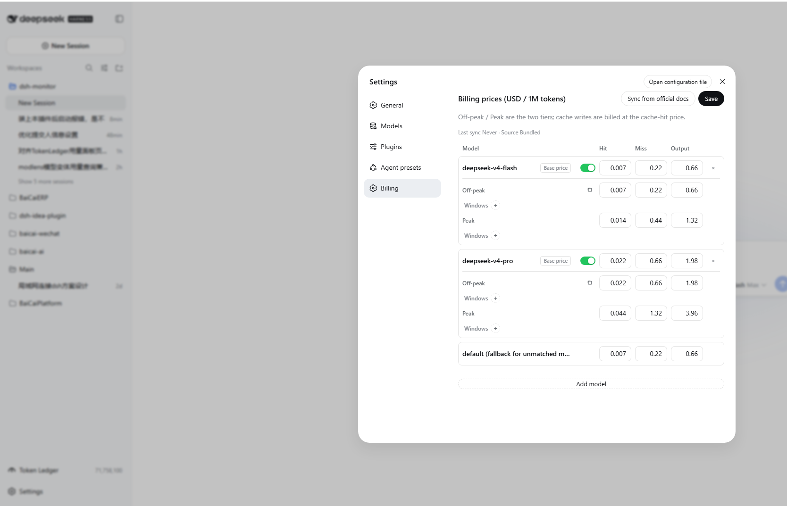
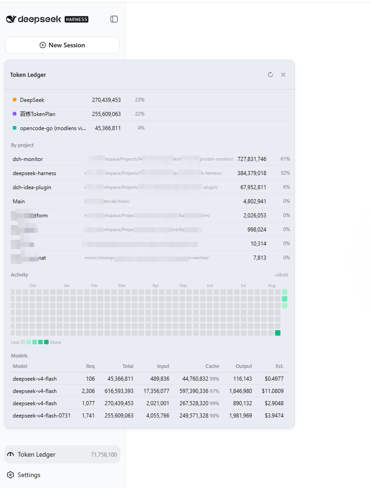

# dsh-monitor

[中文版](README.zh-CN.md) · English

Session billing and per-provider usage quota plugin for DeepSeek Harness.

- **Session cost badge**: wraps `llm/stream`, captures every model call usage and bills precisely against official prices (peak/off-peak tiers + legacy base prices). A chip in the session header shows the session cost in real time with token details; it stays accurate after refresh/reload (event-sourced session projection).
- **Provider usage panel**: configure one usage query per model provider; click the usage icon left of the model switcher to view the quota of the **current session's provider**.
- **Three presets**:
  - **DeepSeek official** (built-in): reuses the API key configured in Settings → Models and queries the official `GET /user/balance` ([docs](https://api-docs.deepseek.com/zh-cn/api/get-user-balance); only `api.deepseek.com`, non-official endpoints refused). **No configuration needed** — when the current session's provider is `deepseek-official`, the balance shows automatically; add a provider with the same id only to override the refresh interval.
  - **OpenCode**: queries the OpenCode Go plan quota — **5 hours / weekly / monthly** usage percent and reset times (`opencode.ai/zen/go/v1/usage`).
  - **Custom**: any HTTP usage endpoint — URL + headers (with `{apiKey}` placeholder) + JSON paths, displayed item by item (percent / number / money / text, optional max and reset time).
- **Official price sync**: one-click sync of the price table and peak windows from the DeepSeek official pricing page; deepseek-v4-flash / deepseek-v4-pro are bundled as defaults.

## Install

```sh
dsh plugin --profile web add https://github.com/Coco-king/dsh-monitor.git#v0.1.1  # GitHub
dsh plugin --profile web add https://gitee.com/kkcoco/dsh-monitor.git#v0.1.1      # Gitee (users in mainland China)
```

The package declares `dsh.bundle.patch`, so it joins the web profile's bundle layer automatically; `dsh plugin --profile web remove dsh-monitor` uninstalls. Restart the web service (or refresh + HMR) to apply.

> Iterating: re-run `dsh plugin --profile web add <this repo path>` after changes; with `pnpm run dev:web` running in the DeepSeek Harness checkout, client changes hot-reload via client HMR.

## Usage

1. **Configure providers**: Settings → Usage → Provider usage config → Add provider. **The provider ID is a dropdown** — candidates are the providers configured in Settings → Models plus the providers you already configured here (including custom ones). Pick a preset and fill the fields, then save. **DeepSeek official is built-in and needs no configuration** — only add a provider for OpenCode, Custom, or to override the DeepSeek refresh interval.

   

   > Chinese-UI screenshot — no English capture yet.

2. **View usage**: click the gauge icon left of the model switcher in the composer. The panel shows the current session provider's quota: provider name + preset badge in the header, refresh icon on the top right.
   - **DeepSeek official balance** (built-in, queries `api.deepseek.com` directly):

     

     > Chinese-UI screenshot — no English capture yet.

   - **OpenCode Go plan** (5-hour / weekly / monthly progress):

     

     > Chinese-UI screenshot — no English capture yet.

3. **Session cost**: the session header shows the session cost chip; hover for input/cache/output token details.

   

   > Chinese-UI screenshot — no English capture yet.

4. **Prices**: Settings → Usage → Billing prices — edit prices, **add models via a provider-grouped dropdown of the models configured in Settings → Models**, or sync from the official docs.

   

5. **Token ledger**: left-side entry `Token Ledger` — shows today / month / cumulative token counts, provider distribution, project distribution, activity heatmap, and per-model breakdown.

   

## Configuration flow

End-to-end path from install to first run:

```
Install
  └─ dsh plugin --profile web add <repo-url>     ← joins the web profile's bundle layer
        │
        ▼
Settings → Models
  ├─ "DeepSeek" provider already exists
  │     └─ Reuses its API key, no extra setup (balance queries api.deepseek.com directly)
  ├─ "opencode-go" provider already exists
  │     └─ Click the usage icon left of its edit button → choose OpenCode preset → Save
  └─ Any third-party provider
        └─ Click the usage icon → choose "Custom HTTP" → fill URL / Headers / JSON paths → Save
        │
        ▼
Settings → Billing
  ├─ deepseek-v4-flash / deepseek-v4-pro are bundled by default (both USD and CNY)
  └─ Edit manually / sync from official docs / add new models from Settings → Models
        │
        ▼
New session → pick a model
  ├─ Session header shows a live cost chip
  ├─ Usage icon (left of model switcher) shows the session's provider quota
  └─ Left-side "Token Ledger" → full breakdown
```

Notes:

- **DeepSeek official is built-in — works without any binding.** Bindings are mainly for OpenCode, Custom, or overriding the DeepSeek refresh interval.
- **Two independent price tables are persisted** (USD / CNY); the active currency is determined by the UI language (zh → CNY, otherwise → USD). Official sync updates both.
- **Each model can declare its own peak/off-peak windows** in UTC. Models with their own windows use them; models with none fall back to the global official windows.
- **Where the config lives**: `$DSH_HOME/storages/dsh-monitor/ledger.json`, under the `config` key (see the next section).

## Config model

Persisted at `$DSH_HOME/storages/dsh-monitor/ledger.json` (`config`):

```jsonc
{
  "locale": "auto",
  "currency": "CNY",
  "symbol": "¥",
  "decimals": 4,
  "exchangeRate": 7.2,
  "peakEnabled": true,
  "peakEffectiveAt": "2026-08-01T00:00:00Z",
  "peakWindows": [{ "start": 1, "end": 4 }, { "start": 6, "end": 10 }],
  "prices": {
    "models": { "deepseek-v4-flash": { "cacheHit": 0.007, "cacheMiss": 0.22, "output": 0.66, "offPeak": {}, "peak": {}, "legacyBase": {} }, "deepseek-v4-pro": {} },
    "default": { "cacheHit": 0.007, "cacheMiss": 0.22, "output": 0.66 }
  },
  "providers": {
    "deepseek": { "enabled": true, "preset": "deepseek", "refreshMinutes": 5, "apiKey": "" },
    "opencode": { "enabled": true, "preset": "opencode", "refreshMinutes": 15, "apiKey": "" },
    "custom1": {
      "enabled": true, "preset": "custom", "refreshMinutes": 10, "apiKey": "k",
      "custom": {
        "url": "https://example.com/usage",
        "headers": { "Authorization": "Bearer {apiKey}" },
        "items": [
          { "key": "weekly", "label": "This week", "kind": "percent", "path": "usage.weekly.percent", "maxPath": null, "resetsAtPath": "usage.weekly.resetsAt" },
          { "key": "tokens", "label": "Tokens", "kind": "number", "path": "usage.tokens", "maxPath": 1000000, "resetsAtPath": null }
        ]
      }
    }
  },
  "historyDays": 180,
  "fetchedAt": null,
  "priceSource": "bundled"
}
```

Custom item fields:

| Field | Meaning |
|---|---|
| `key` | Unique item id |
| `label` | Display name |
| `kind` | `percent` (value is already a percent) / `number` / `money` / `text` |
| `path` | Dotted JSON path, e.g. `usage.weekly.percent` |
| `maxPath` | Max: numeric constant or JSON path; when present, percent = value/max×100 |
| `resetsAtPath` | Reset-time JSON path (optional) |

## Security notes

- DeepSeek balance: only the official host `api.deepseek.com` is ever contacted; other endpoints are refused and the key is never sent.
- OpenCode: only `opencode.ai`; key resolution order: config `apiKey` → DSH credential `OPENCODE_GO_API_KEY` → env `OPENCODE_GO_API_KEY` / `OPENCODE_API_KEY` → `opencode auth.json`.
- Custom: the target URL and headers are user-configured; credentials are your own responsibility.

## Development

```sh
npm install --cache ./.npm-cache   # sandboxed environments must keep the cache inside the workspace
npm test                           # node --test, 37 cases
npm run build:client               # bundle lib/client-src/ → lib/client.js (single-file bundle)
npm run dev:client                 # rebuild on change (--watch)
```

Layout:

- Host: `lib/index.js` (plugin entry + `llm/stream` billing wrapper, re-exports the public API), `lib/messages.js` (server copy), `lib/projection.js` (costUsage session projection), `lib/queries.js` (DeepSeek balance / OpenCode plan / custom HTTP queries), `lib/monitor.js` (monitor service: cache / listCatalog / official price sync), `lib/store.js` (ledger + config validation), `lib/pricing.js` (prices/peak/official parse), `lib/typert.host.js` (Typert manifest).
- Browser: `lib/client.js` is an **esbuild artifact** (DSH's module loader only resolves host-managed module names, so the shipped bundle must be one file; do not edit it by hand). Source lives in `lib/client-src/`: `main.js` (entry/wiring), `styles.js`, `i18n.js`, `codecs.js`, `format.js`, `panel.js` (usage icon/panel/cost badge), `settings.js` (Settings → Usage page); `scripts/build-client.mjs` bundles it, injects a content-derived BUILD_TAG, and smoke-checks the result.
- Iterating: after changing client sources run `npm run build:client` (or `npm run dev:client` watch) and re-`dsh plugin --profile web add <repo>`; with `pnpm run dev:web` running in the DSH repo, client changes can hot-reload via client HMR.

Billing and pricing math are ported from [dsh-cost-meter](https://github.com/Han-1413141/dsh-cost-meter) (MIT).

The usage ledger and per-provider usage panel are referenced from [TokenLedger](https://github.com/zh667/TokenLedger) (MIT).

## License

MIT