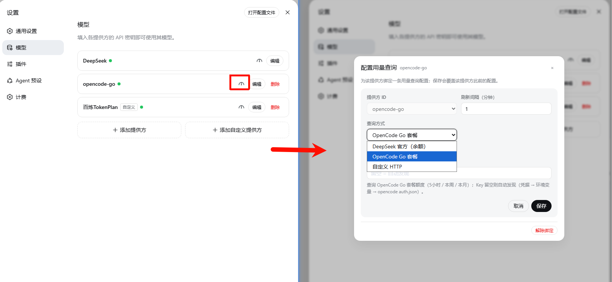
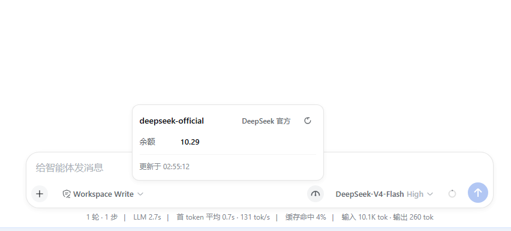
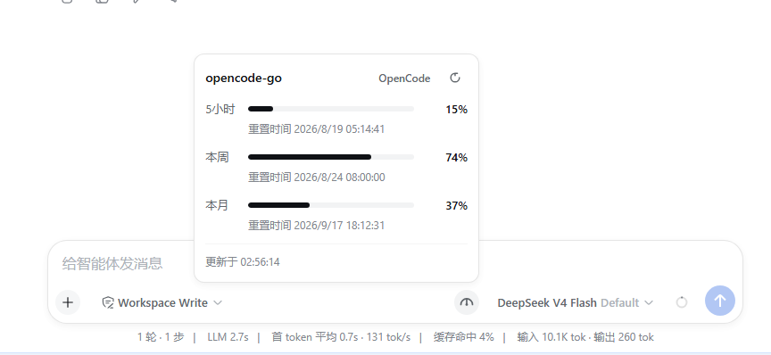
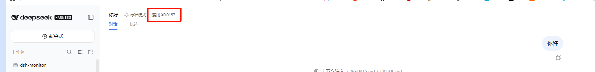
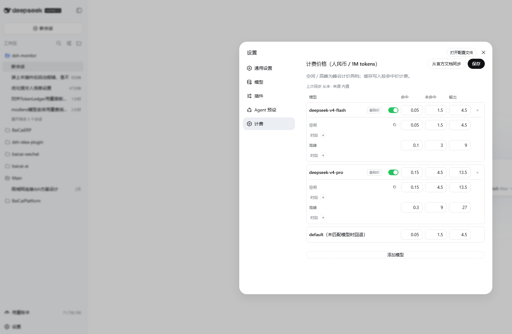
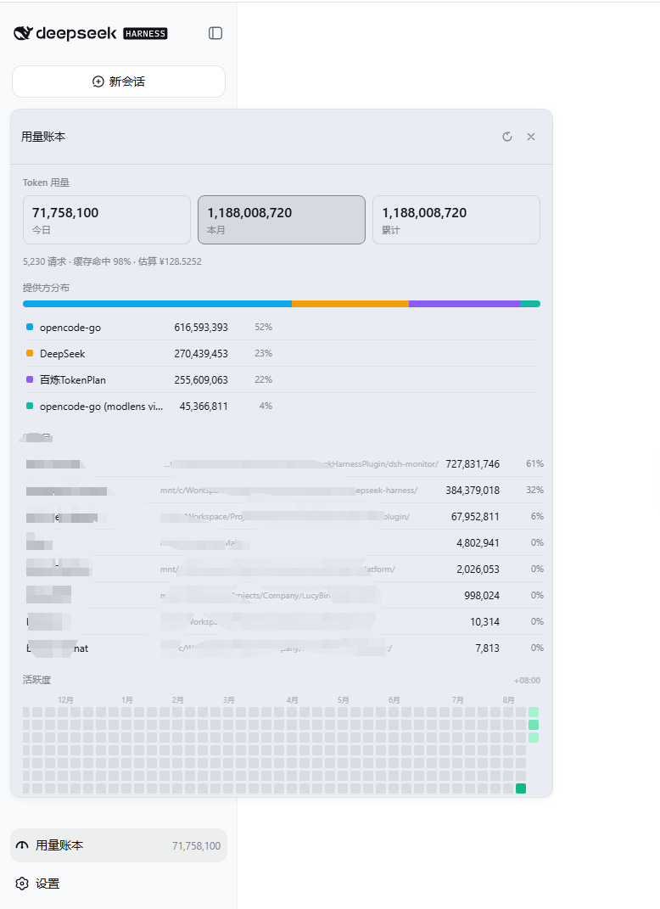

# dsh-monitor

[English](README.md) · 中文

DeepSeek Harness 会话计费 + 通用提供方用量查询插件。

- **会话费用角标**：包裹 `llm/stream` 捕获每次模型调用 usage，按官方价格（峰谷两档）精确计费，在会话头部实时显示本会话费用与 token 明细；刷新/重载后依然准确（会话投影事件源回放）。
- **提供方用量面板**：按模型提供方配置用量查询（每个提供方一条配置），在模型切换器左侧的用量图标处点击查看**当前会话所用提供方**的额度。
- **三种预设**：
  - **DeepSeek 官方**（内置）：复用 设置→模型 中配置的 API Key，直查官方 `GET /user/balance`（[文档](https://api-docs.deepseek.com/zh-cn/api/get-user-balance)，仅发往 `api.deepseek.com`，非官方端点拒绝）。**无需任何配置**——当前会话提供方为 `deepseek-official` 时自动显示余额；如想调整刷新间隔可在设置页添加同名 provider 覆盖。
  - **OpenCode**：查询 OpenCode Go 套餐额度——**5小时 / 本周 / 本月** 用量百分比与重置时间（`opencode.ai/zen/go/v1/usage`）。
  - **自定义**：任意 HTTP 用量接口——URL + 请求头（支持 `{apiKey}` 占位）+ JSON 取值路径，逐条展示（percent / number / money / text，可带上限与重置时间）。
- **官方价格同步**：一键从 DeepSeek 官方定价页同步价格表与峰谷窗口；默认预置 deepseek-v4-flash / deepseek-v4-pro。

## 安装

```sh
dsh plugin --profile web add https://github.com/Coco-king/dsh-monitor.git#v0.1.2  # GitHub(默认)
dsh plugin --profile web add https://gitee.com/kkcoco/dsh-monitor.git#v0.1.2      # Gitee(国内可用)
```

包声明了 `dsh.bundle.patch`，安装后自动加入 web profile 的 bundle 层栈；`dsh plugin --profile web remove dsh-monitor` 可卸载。重启 web 服务（或刷新页面 + HMR）后生效。

> 开发迭代：改代码后重新 `dsh plugin --profile web add <本仓库路径>`；若在 DeepSeek Harness 仓库内跑 `pnpm run dev:web`，客户端改动可经 client HMR 热更新。

## 使用

1. **配置提供方用量查询**:设置 → 模型,在目标提供方条目的**编辑按钮左侧**点击用量图标(悬浮提示「配置用量查询」),在弹窗里选择查询方式(**DeepSeek 官方余额 / OpenCode Go 套餐 / 自定义 HTTP**)并填写字段后保存——**保存会覆盖该提供方此前的绑定配置**;弹窗底部可「解除绑定」。**DeepSeek 官方为内置,不绑定也可用**——绑定主要用于 OpenCode、自定义或自定义 DeepSeek 刷新间隔。

   

2. **查看用量**:输入栏右侧(模型切换器左侧)点击用量图标,面板展示当前会话提供方的额度;头部显示提供方名字与预设徽标,右上角刷新图标强制刷新。
   - **DeepSeek 官方余额**(内置,直查 `api.deepseek.com`):

     

   - **OpenCode Go 套餐**(5 小时 / 本周 / 本月进度):

     

3. **会话费用**:会话头部显示本会话费用 chip,悬停查看输入/缓存/输出 token 明细。

   

4. **价格**:设置 → 计费,配置模型价格(手动编辑 / 从 设置→模型 新增模型 / 从官方文档同步)。

   

5. **用量账本**:左侧导航 「用量账本」 入口,展示今日 / 本月 / 累计 token、提供方分布、项目分布、活跃度热力图、模型详单。

   

## 配置流程

从安装到首跑的完整路径:

```
安装插件
  └─ dsh plugin --profile web add <repo-url>     ← 加入 web profile 的 bundle 层
        │
        ▼
设置 → 模型
  ├─ 已存在「DeepSeek」 提供方
  │     └─ 复用其 API Key,无需任何配置(余额直查 api.deepseek.com)
  ├─ 已存在「opencode-go」 提供方
  │     └─ 点击编辑按钮左侧的用量图标,选 OpenCode 套餐预设 → 保存
  └─ 其他第三方提供方
        └─ 点击用量图标,选「自定义 HTTP」 → 填 URL / Headers / JSON 路径 → 保存
        │
        ▼
设置 → 计费
  ├─ 已默认预置 deepseek-v4-flash / deepseek-v4-pro(双币种)
  └─ 手动调整 / 同步官方 / 从设置→模型新增
        │
        ▼
新会话 → 选择模型
  ├─ 会话头部实时显示费用 chip
  ├─ 输入栏左侧用量图标 → 当前会话提供方额度
  └─ 左侧「用量账本」 → 全量明细
```

要点:

- **DeepSeek 官方为内置,「不绑定也可用」**;绑定主要是为了 OpenCode / 自定义,或自定义 DeepSeek 刷新间隔。
- **价格表分两套独立存**(USD / CNY),由界面语言决定生效币种(zh → CNY,其余 → USD);官方同步会同时更新两套。
- **每个模型可独立设置峰谷窗口**;模型设了自己的窗口就按自己的判定,完全没设才回退到全局官方窗口。
- **配置落地**:`$DSH_HOME/storages/dsh-monitor/ledger.json` 的 `config` 字段(详见下一节)。

## 配置模型

持久化于 `$DSH_HOME/storages/dsh-monitor/ledger.json`（`config` 字段）：

```jsonc
{
  "locale": "auto",            // auto | zh | en
  "decimals": 4,
  "peakEnabled": true,         // 峰谷计价
  "peakEffectiveAt": "2026-08-01T00:00:00Z",
  "peakWindows": [{ "start": 1, "end": 4 }, { "start": 6, "end": 10 }],
  "prices": {                  // 双币种独立价格表;生效币种按界面语言(zh→cny,其他→usd)
    "usd": {                   // 美元 / 1M tokens;cacheWrite 按命中价计
      "models": { "deepseek-v4-flash": { "cacheHit": 0.007, "cacheMiss": 0.22, "output": 0.66, "offPeak": {}, "peak": {} }, "deepseek-v4-pro": {} },
      "default": { "cacheHit": 0.007, "cacheMiss": 0.22, "output": 0.66 }
    },
    "cny": {                   // 人民币 / 1M tokens(中文界面按此计费与展示)
      "models": { "deepseek-v4-flash": { "cacheHit": 0.05, "cacheMiss": 1.5, "output": 4.5, "offPeak": {}, "peak": {} }, "deepseek-v4-pro": {} },
      "default": { "cacheHit": 0.05, "cacheMiss": 1.5, "output": 4.5 }
    }
  },
  "providers": {
    "deepseek-official": { "enabled": true, "preset": "deepseek", "refreshMinutes": 5, "apiKey": "" }, // 可选(覆盖内置默认)
    "opencode": { "enabled": true, "preset": "opencode", "refreshMinutes": 15, "apiKey": "" },
    "custom1": {
      "enabled": true, "preset": "custom", "refreshMinutes": 10, "apiKey": "k",
      "custom": {
        "url": "https://example.com/usage",
        "headers": { "Authorization": "Bearer {apiKey}" },
        "items": [
          { "key": "weekly", "label": "本周", "kind": "percent", "path": "usage.weekly.percent", "maxPath": null, "resetsAtPath": "usage.weekly.resetsAt" },
          { "key": "tokens", "label": "Tokens", "kind": "number", "path": "usage.tokens", "maxPath": 1000000, "resetsAtPath": null }
        ]
      }
    }
  },
  "historyDays": 180,
  "fetchedAt": null,
  "priceSource": "bundled"     // bundled | official
}
```

自定义条目字段：

| 字段 | 说明 |
|---|---|
| `key` | 条目唯一 id |
| `label` | 展示名 |
| `kind` | `percent`(值即百分比) / `number` / `money` / `text` |
| `path` | 响应 JSON 点路径,如 `usage.weekly.percent` |
| `maxPath` | 上限:数字常量或 JSON 路径;存在时自动计算 percent = value/max×100 |
| `resetsAtPath` | 重置时间 JSON 路径(可选) |

## 权限说明

- DeepSeek 余额：仅请求官方域名 `api.deepseek.com`，其余端点一律拒绝且不发送 Key。
- OpenCode：仅请求官方域名 `opencode.ai`，Key 解析顺序：配置 `apiKey` → DSH 凭据 `OPENCODE_GO_API_KEY` → 环境变量 `OPENCODE_GO_API_KEY` / `OPENCODE_API_KEY` → `opencode auth.json`。
- 自定义：请求目标与头由用户配置，凭证自担风险。

## 开发

```sh
npm install --cache ./.npm-cache   # 沙箱环境缓存须落在工作区内
npm test                           # node --test,37 个用例
npm run build:client               # 客户端打包:lib/client-src/ → lib/client.js(单文件 bundle)
npm run dev:client                 # 监听 lib/client-src/ 增量重建(--watch)
```

结构:

- 主机侧:`lib/index.js`(插件入口 + llm/stream 计费包裹,re-export 公开 API)、
  `lib/messages.js`(服务端文案)、`lib/projection.js`(costUsage 会话投影)、
  `lib/queries.js`(DeepSeek 余额 / OpenCode 套餐 / 自定义 HTTP 三类查询)、
  `lib/monitor.js`(monitor 服务:缓存/listCatalog/官方价格同步)、
  `lib/store.js`(账本+配置校验)、`lib/pricing.js`(价格/峰谷/官方解析)、
  `lib/typert.host.js`(Typert 清单)。
- 浏览器侧:`lib/client.js` 是 **esbuild 构建产物**(DSH 的 module loader 只解析
  托管模块名,产物必须为单文件,勿手改);源码在 `lib/client-src/`:`main.js`
  (入口/接线)、`styles.js`(样式+注入)、`i18n.js`(文案)、`codecs.js`(线路
  校验+Typert 贡献清单)、`format.js`(计价/显示助手)、`panel.js`(用量图标/
  面板/会话角标)、`settings.js`(计费价格页 + 绑定表单 ProviderForm)、
  `binding.js`(设置→模型 每行「配置用量查询」图标的 DOM 注入 + 绑定弹窗);
  构建脚本 `scripts/build-client.mjs` 负责打包、按产物注入 BUILD_TAG 并做加载自检。
- 开发迭代:改客户端源码后 `npm run build:client`(或 `npm run dev:client` watch),
  再重新 `dsh plugin --profile web add <本仓库路径>`;若在 DeepSeek Harness 仓库内跑
  `pnpm run dev:web`,客户端改动可经 client HMR 热更新。

计费与价格数学移植自 [dsh-cost-meter](https://github.com/Han-1413141/dsh-cost-meter)(MIT)。

用量账本与提供方用量面板参考自 [TokenLedger](https://github.com/zh667/TokenLedger)(MIT)。

## License

MIT